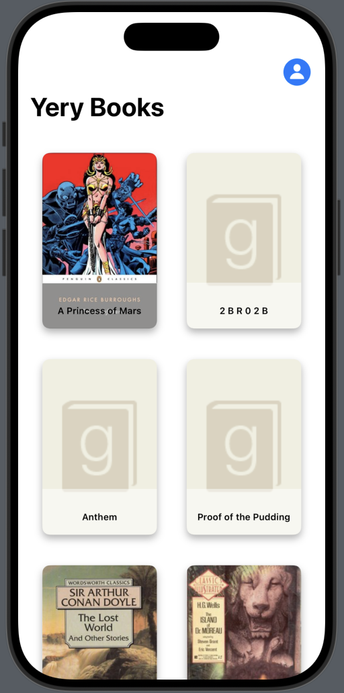
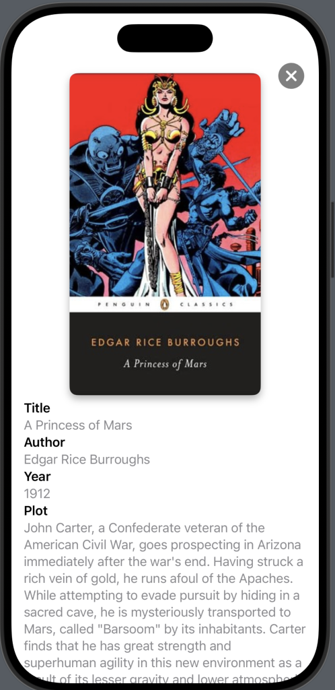

# 📚 YeryLibrary

**YeryLibrary** es una aplicación iOS desarrollada en **SwiftUI** que permite gestionar una colección de libros con persistencia local mediante **SwiftData**.

---

## 📸 Preview

  
  

---

## 📱 Características principales

- Interfaz desarrollada con **SwiftUI** para una experiencia fluida y moderna.
- Persistencia local mediante **SwiftData** utilizando modelos `@Model`.
- **Navegación programática** con `NavigationStack` y `NavigationPath`.
- Organización de libros en dos secciones principales:
  - **Library**: Todos los libros disponibles.
  - **Readed**: Libros marcados como leídos.
- **Gestión dinámica** con menús contextuales para marcar libros como leídos.
- Pantallas de detalle con información completa del libro.
- Soporte para datos locales mediante JSON o integración con **SwiftData**.
- Diseño responsive adaptado para todos los tamaños de pantalla.

---

## ✅ Funcionalidades

- **Pestañas principales**:
  - **Library**:
    - Muestra un **grid** con las portadas de los libros.
    - **Menú contextual** sobre cada tarjeta:
      - `Mark as Read` → Marca el libro como leído y lo agrega a la pestaña de libros leídos.
    - **Navegación al detalle** al tocar la tarjeta.
  - **Readed**:
    - Lista todos los libros que fueron marcados como leídos.

- **Pantalla Detalle del Libro**:
  Incluye la siguiente información:
  - `Cover`: Portada del libro.
  - `Title`: Título del libro.
  - `Author`: Nombre del autor.
  - `Year`: Año de publicación.
  - `Plot`: Descripción general.
  - `Summary`: Resumen del libro.
  - `Price`: Precio del libro.
  - `Pages`: Número de páginas.
  - `Rating`: Puntuación.
  - `ISBN`: Número identificador ISBN.

- **Persistencia de datos** implementada con **SwiftData**.
- **Navegación programática** para un flujo dinámico sin enlaces estáticos.

---

## 🛠️ Tecnologías y dependencias

- **SwiftUI** → Interfaz declarativa.
- **SwiftData** → Persistencia nativa con modelos `@Model`.
- **NavigationStack** y **NavigationPath** → Navegación programática.
- Lenguaje: **Swift 5.9**
- Compatible con **iOS 17+**

---

## ▶️ Flujo de uso

- **Library Tab**:
   - Visualiza todos los libros en un **LazyVGrid**.
   - Mantén pulsado un libro para desplegar el menú contextual `Mark as Read`.
   - Pulsa sobre un libro para navegar a su detalle.
   
- **Readed Tab**:
   - Visualiza los libros marcados como leídos en formato lista.
   
- **Detalle del libro**:
   - Accede a la información completa del libro organizada en secciones.

---

## 📱 Requisitos

- **iOS 17.0 o superior**
- **Xcode 15 o superior**
- **Simulador o dispositivo compatible con SwiftUI**
